# 🚪🔐 Smart IoT Door Lock - Your Digital Guardian

> **Transform any door into a smart, secure gateway with ESP32 magic!**

Welcome to the future of home security! This hybrid smart lock system combines the reliability of physical keypads with the convenience of remote control, creating a seamless bridge between traditional security and modern IoT innovation.

[](https://www.espressif.com/)
[](https://fastapi.tiangolo.com/)
[](https://render.com/)
[](https://streamlit.io/)

---

## ✨ Why This Matters

Ever locked yourself out? Forgotten your keys? Wanted to let someone in while you're away? This smart lock system solves real problems with elegant technology:

- **Never get locked out again** - Remote unlock from anywhere
- **No more hiding spare keys** - Secure PIN-based access
- **Grant temporary access** - Change PINs remotely for visitors
- **Peace of mind** - Always know your door's status

---

## 🎯 Core Features

### 🏠 **Local Access Mode**
- **4x4 Matrix Keypad** - Enter your PIN like a pro
- **Instant Feedback** - LCD displays status, buzzer confirms actions
- **Offline Operation** - Works even without internet

### 🌍 **Remote Control Hub**
- **Streamlit Web Dashboard** - Beautiful, intuitive interface
- **One-Click Unlock** - Open your door from anywhere in the world
- **Dynamic PIN Management** - Update access codes on the fly
- **Real-time Status** - See if your door is locked or unlocked

### 🔧 **Smart Hardware**
- **Servo-Powered Lock** - Smooth, reliable mechanical action
- **Visual Feedback** - Clear LCD status messages
- **Audio Alerts** - Buzzer notifications for every action
- **Rock-Solid Connectivity** - ESP32 Wi-Fi keeps you connected

---

## 🏗️ The Tech Stack That Powers Your Security

```mermaid
graph TB
    A[📱 Streamlit Dashboard] --> B[⚡ FastAPI Backend]
    B --> C[☁️ Render Cloud]
    C --> D[🌐 Internet]
    D --> E[📡 ESP32 WiFi]
    E --> F[🔐 Servo Controlled Lock]
    E --> G[⌨️ Keypad Input]
    E --> H[📺 LCD Display]
    E --> I[🔊 Buzzer Alert]
```



### 🛠️ **Hardware Arsenal**

| Component | Role | Why It's Perfect |
|-----------|------|------------------|
| **ESP32** | 🧠 Brain | Built-in WiFi, powerful processing, Arduino-friendly |
| **4x4 Keypad** | 🔢 Input | Tactile, reliable, familiar interface |
| **Servo Motor** | 💪 Muscle | Precise control, strong torque, easy integration |
| **I2C LCD** | 👁️ Eyes | Clear status display, low pin usage |
| **Buzzer** | 🔊 Voice | Instant audio feedback, simple implementation |
| **Power Supply** | ⚡ Heart | Stable 5V keeps everything running smooth |

---

## 🚀 System Architecture

### **The Magic Happens in Three Layers:**

#### 1. **🏠 Hardware Layer (ESP32)**
Your door's digital brain that:
- Monitors keypad input continuously
- Controls the servo motor with precision
- Manages LCD display and buzzer feedback
- Maintains WiFi connection for remote commands

#### 2. **☁️ Cloud Layer (FastAPI + Render)**
The command center that:
- Receives requests from your web dashboard
- Validates security credentials
- Sends commands to your ESP32
- Handles all the heavy lifting in the cloud

#### 3. **🖥️ Interface Layer (Streamlit)**
Your control panel that:
- Provides a beautiful, responsive web interface
- Enables one-click door control
- Manages PIN changes securely
- Shows real-time system status

---

## 📂 Repository Structure

```plaintext
├── firmware/            # ESP32 firmware code
│   └── firmware.ino
├── streamlit_app/       # Web interface (Streamlit)
│   └── app.py
├── api_server/          # PythonAnywhere API backend
|   └── test/
|   |   └── one.py
|   |   └── api_client.py
│   └── main.py
├── circuit_prototyping/     # Fritzing or schematic files
├── README.md
```

## 🎨 What Makes This Special

### **🔒 Security First**
- PIN-based authentication
- Secure API endpoints
- Encrypted communication
- No sensitive data stored locally

### **🌟 User Experience**
- Intuitive web interface
- Instant feedback on all actions
- Clear status indicators
- Responsive design for mobile

### **🔧 Developer Friendly**
- Clean, modular code structure
- Well-documented APIs
- Easy to extend and customize
- Open source and hackable

### **☁️ Modern Deployment**
- FastAPI for lightning-fast APIs
- Render for reliable cloud hosting
- Streamlit for rapid prototyping
- Seamless CI/CD integration

---

## 🚦 Getting Started

Ready to secure your space? Jump into the installation guide and have your smart lock running in minutes!

### **Prerequisites**
- ESP32 development board
- Basic electronics components (see hardware list)
- Python 3.8+ for local development
- Render account for deployment

### **Quick Start**
1. **Clone this repository**
2. **Set up your hardware** (wiring diagrams included)
3. **Deploy the API** to Render
4. **Configure the ESP32** with your WiFi credentials
5. **Launch the Streamlit dashboard**
6. **Start unlocking doors like a tech wizard!** 🧙‍♂️

---

## 🤝 Contributing

Found a bug? Have a cool feature idea? Want to add support for fingerprint sensors? 

**We'd love your contributions!** This project thrives on community input and creative enhancements.

---

## 📜 License

This project is open source and available under the MIT License. Build amazing things!

---

**🎯 Ready to revolutionize your door security? Let's build the future, one smart lock at a time!**
